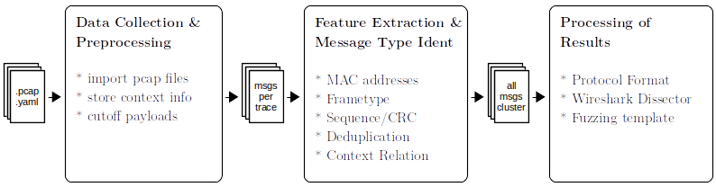

Layer 2 Protocol Reverse Engineering

## Description

`l2pre` is a tool to reverse engineer protocols working on the data link layer e.g., protocols similar to IEEE 802.11 or protocols of (wireless) embedded devices. It looks for address, frame type, sequence and checksum fields. Furthermore, it can infer context related fields if context information is submitted via `.yaml` files. Speaking of input files, `l2pre` takes `.pcapng` files that are captures of the protocol at question. See [the example](#example) to get an impression of the usage of `l2pre`. The figure below shows the general idea.



## Build and Dependencies

### Clone and install all dependencies

You need libpcap and Python 3.8 and a bunch of python modules (installed via pip, so you need that as well). If you want to measure [the FMS](#format-match-score), you need tshark as well.

The following commands are based on a Debian system, in case you want to execute the scripts on your system directly. We recommend using the Docker container instead, to prevent any dependecy problems at all. See [Dockerfile usage](#dockerfile).

```
apt-get update && apt-get install libpcap-dev tshark git python3 python3-pip
git clone --recursive https://github.com/techge/l2pre.git
cd l2pre
pip3 install pylstar==0.1.2 numpy==1.20.2
cd src/netzob-src/netzob && python3 setup.py install && cd ../..
pip3 install -r src/nemesys/requirements.txt
pip3 install -r requirements.txt
```

### Dockerfile

There is a Dockerfile provided so that you can use l2pre without worrying about dependencies. The following code builds the image and starts a container with the directory bind as a volume so that input files can be easily used and generated reports can be easily accessed even after stopping the container.

```
git clone --recursive https://github.com/techge/l2pre.git
cd l2pre
docker build . -t l2pre:latest
docker run -ti --mount type=bind,source=$(pwd),target=/l2pre/ l2pre:latest
```

For the use of `src/l2pre_fms.py` where tshark is going to be used, we need to add the `--privileged` flag to the run command above.

## Usage

### General

```
$ ./src/l2pre.py --help
usage: l2pre.py [-h] [-l LAYER] [-nt] [-i] [-b] [-e] [-w] PCAPs [PCAPs ...]

Layer 2 Protocol Reverse Engineering

positional arguments:
  PCAPs                 pcap/pcapng files with network traffic to be analyzed

optional arguments:
  -h, --help            show this help message and exit
  -l LAYER, --layer LAYER
                        Layer to import, defaults to 1 (use 2 if importing stuff in Radiotap header)
  -nt, --no-tunnel      Do not look for Ethernet frames while searching for payloads. To use in case
                        of layer 2 replacements of Ethernet, but NOT in case of tunneled Ethernet+X
                        traffic
  -i, --interactive     start interactive session after automatic protocol reversing
  -b, --export-bf       export boofuzz template
  -e, --export-pf       export protocol format
  -w, --export-ws       export wireshark dissector
```

### Example

In folder [input/iPCF](input/iPCF) are network traces captured with context information stored in .yaml files. These can serve as an examplary case to reverse engineer the structure of these fields to understand the general idea.

```
$ ./src/l2pre.py -l 2 -e input/iPCF/iPCF_{1,2}.pcapng

Import PCAP files...

Try to find and cut off payloads with known protocols...

Start feature detection...

> Find basic features in messages (MAC, SEQ and Checksum fields)...

> Find features by comparing context information...

> Deduplicate messages...

Symbol_1c020000: 4 unique messages
Frame_type | MAC            | MAC            | MAC            | Field    | channel | Field  | channel | Field
---------- | -------------- | -------------- | -------------- | -------- | ------- | ------ | ------- | -----
'1c020000' | 'ffffffffffff' | 'd4f5275645a0' | 'd4f5275645a0' | '10bb10' | '9d'    | '60ad' | '01'    | '00'
'1c020000' | 'ffffffffffff' | 'd4f5275645a0' | 'd4f5275645a0' | 'a0cc10' | '9d'    | '60ad' | '01'    | '80'
'1c020000' | 'ffffffffffff' | 'd4f5275645a0' | 'd4f5275645a0' | '703a10' | 'a1'    | '60ad' | '00'    | '00'
'1c020000' | 'ffffffffffff' | 'd4f5275645a0' | 'd4f5275645a0' | '404d10' | 'a1'    | '60ad' | '00'    | '80'
---------- | -------------- | -------------- | -------------- | -------- | ------- | ------ | ------- | -----

Symbol_2c013c00: 7 unique messages
Frame_type | MAC            | MAC            | MAC            | SEQ    | Field | SEQ  | Field      | Checksum
---------- | -------------- | -------------- | -------------- | ------ | ----- | ---- | ---------- | ----------
'2c013c00' | 'd4f5275645a0' | 'd4f5274188c0' | 'd4f5275645a0' | '0000' | '10'  | '00' | '00000000' | '00000000'
'2c013c00' | 'd4f5275645a0' | 'd4f5274188c0' | 'd4f5275645a0' | '0000' | '14'  | '00' | '005e0000' | '00000000'
'2c013c00' | 'd4f5275645a0' | 'd4f5274188c0' | 'd4f5275645a0' | '0000' | '14'  | '00' | '004a0000' | '00000000'
'2c013c00' | 'd4f5275645a0' | 'd4f5274188c0' | 'd4f5275645a0' | '0000' | '14'  | '00' | '00460000' | '00000000'
'2c013c00' | 'd4f5275645a0' | 'd4f5274188c0' | 'd4f5275645a0' | '0000' | '14'  | '00' | '00650000' | '00000000'
'2c013c00' | 'd4f5275645a0' | 'd4f5274188c0' | 'd4f5275645a0' | '0000' | '14'  | '00' | '00740000' | '00000000'
'2c013c00' | 'd4f5275645a0' | 'd4f5274188c0' | 'd4f5275645a0' | '0000' | '14'  | '00' | '004d0000' | '00000000'
---------- | -------------- | -------------- | -------------- | ------ | ----- | ---- | ---------- | ----------

Symbol_2c023c00: 143 unique messages
(only showing 30 here)
Frame_type | MAC            | MAC            | MAC            | SEQ    | Field  | SEQ  | channel | Field  | Checksum
---------- | -------------- | -------------- | -------------- | ------ | ------ | ---- | ------- | ------ | ----------
'2c023c00' | 'd4f5274188c0' | 'd4f5275645a0' | 'd4f5275645a0' | '0000' | '1e00' | '00' | '9d'    | '05ee' | '00000000'
'2c023c00' | 'd4f5274188c0' | 'd4f5275645a0' | 'd4f5275645a0' | '0000' | '1600' | '00' | '9d'    | '0fff' | '00000000'
'2c023c00' | 'd4f5274188c0' | 'd4f5275645a0' | 'd4f5275645a0' | '0000' | '169d' | '00' | '9d'    | '0fff' | '00000000'
'2c023c00' | 'd4f5274188c0' | 'd4f5275645a0' | 'd4f5275645a0' | '0000' | '1e9d' | '00' | '9d'    | '05ee' | '00000000'
'2c023c00' | 'd4f5274188c0' | 'd4f5275645a0' | 'd4f5275645a0' | '0000' | '1699' | '00' | '9d'    | '0fff' | '00000000'
'2c023c00' | 'd4f5274188c0' | 'd4f5275645a0' | 'd4f5275645a0' | '0000' | '1e99' | '00' | '9d'    | '05ee' | '00000000'
'2c023c00' | 'd4f5274188c0' | 'd4f5275645a0' | 'd4f5275645a0' | '0000' | '160a' | '00' | '9d'    | '0fff' | '00000000'
'2c023c00' | 'd4f5274188c0' | 'd4f5275645a0' | 'd4f5275645a0' | '0000' | '1e0a' | '00' | '9d'    | '05ee' | '00000000'
'2c023c00' | 'd4f5274188c0' | 'd4f5275645a0' | 'd4f5275645a0' | '0000' | '1618' | '00' | '9d'    | '0fff' | '00000000'
'2c023c00' | 'd4f5274188c0' | 'd4f5275645a0' | 'd4f5275645a0' | '0000' | '1e18' | '00' | '9d'    | '05ee' | '00000000'
'2c023c00' | 'd4f5274188c0' | 'd4f5275645a0' | 'd4f5275645a0' | '0000' | '1600' | '00' | '9d'    | '05ee' | '00000000'
'2c023c00' | 'd4f5274188c0' | 'd4f5275645a0' | 'd4f5275645a0' | '0000' | '1677' | '00' | '9d'    | '0fff' | '00000000'
'2c023c00' | 'd4f5274188c0' | 'd4f5275645a0' | 'd4f5275645a0' | '0000' | '1e77' | '00' | '9d'    | '05ee' | '00000000'
'2c023c00' | 'd4f5274188c0' | 'd4f5275645a0' | 'd4f5275645a0' | '0000' | '1696' | '00' | '9d'    | '0fff' | '00000000'
'2c023c00' | 'd4f5274188c0' | 'd4f5275645a0' | 'd4f5275645a0' | '0000' | '1e96' | '00' | '9d'    | '05ee' | '00000000'
'2c023c00' | 'd4f5274188c0' | 'd4f5275645a0' | 'd4f5275645a0' | '0000' | '160a' | '00' | '9d'    | '05ee' | '00000000'
'2c023c00' | 'd4f5274188c0' | 'd4f5275645a0' | 'd4f5275645a0' | '0000' | '166c' | '00' | '9d'    | '0fff' | '00000000'
'2c023c00' | 'd4f5274188c0' | 'd4f5275645a0' | 'd4f5275645a0' | '0000' | '1e6c' | '00' | '9d'    | '05ee' | '00000000'
'2c023c00' | 'd4f5274188c0' | 'd4f5275645a0' | 'd4f5275645a0' | '0000' | '16ac' | '00' | '9d'    | '0fff' | '00000000'
'2c023c00' | 'd4f5274188c0' | 'd4f5275645a0' | 'd4f5275645a0' | '0000' | '1eac' | '00' | '9d'    | '05ee' | '00000000'
'2c023c00' | 'd4f5274188c0' | 'd4f5275645a0' | 'd4f5275645a0' | '0000' | '1696' | '00' | '9d'    | '05ee' | '00000000'
'2c023c00' | 'd4f5274188c0' | 'd4f5275645a0' | 'd4f5275645a0' | '0000' | '166c' | '00' | '9d'    | '05ee' | '00000000'
'2c023c00' | 'd4f5274188c0' | 'd4f5275645a0' | 'd4f5275645a0' | '0000' | '1e00' | '00' | 'a1'    | '05ee' | '00000000'
'2c023c00' | 'd4f5274188c0' | 'd4f5275645a0' | 'd4f5275645a0' | '0000' | '1600' | '00' | 'a1'    | '0fff' | '00000000'
'2c023c00' | 'd4f5274188c0' | 'd4f5275645a0' | 'd4f5275645a0' | '0000' | '16e2' | '00' | 'a1'    | '0fff' | '00000000'
'2c023c00' | 'd4f5274188c0' | 'd4f5275645a0' | 'd4f5275645a0' | '0000' | '1ee2' | '00' | 'a1'    | '05ee' | '00000000'
'2c023c00' | 'd4f5274188c0' | 'd4f5275645a0' | 'd4f5275645a0' | '0000' | '16f8' | '00' | 'a1'    | '0fff' | '00000000'
'2c023c00' | 'd4f5274188c0' | 'd4f5275645a0' | 'd4f5275645a0' | '0000' | '1ef8' | '00' | 'a1'    | '05ee' | '00000000'
'2c023c00' | 'd4f5274188c0' | 'd4f5275645a0' | 'd4f5275645a0' | '0000' | '166b' | '00' | 'a1'    | '0fff' | '00000000'
'2c023c00' | 'd4f5274188c0' | 'd4f5275645a0' | 'd4f5275645a0' | '0000' | '1e6b' | '00' | 'a1'    | '05ee' | '00000000'
---------- | -------------- | -------------- | -------------- | ------ | ------ | ---- | ------- | ------ | ----------

Symbol_0c020000: 2 unique messages
Frame_type | MAC            | MAC            | MAC            | SEQ    | Field | channel | Checksum
---------- | -------------- | -------------- | -------------- | ------ | ----- | ------- | ----------
'0c020000' | 'ffffffffffff' | 'd4f5275645a0' | 'd4f5275645a0' | '0000' | '10'  | '9d'    | '00000000'
'0c020000' | 'ffffffffffff' | 'd4f5275645a0' | 'd4f5275645a0' | '0000' | '10'  | 'a1'    | '00000000'
---------- | -------------- | -------------- | -------------- | ------ | ----- | ------- | ----------

Symbol_2c093c00: 6 unique messages
Frame_type | MAC            | MAC            | MAC            | Field
---------- | -------------- | -------------- | -------------- | --------------------------
'2c093c00' | 'd4f5275645a0' | 'd4f5274188c0' | 'd4f5275645a0' | 'c0351068000000002ffd4f66'
'2c093c00' | 'd4f5275645a0' | 'd4f5274188c0' | 'd4f5275645a0' | '90bb10c50000000061c4f763'
'2c093c00' | 'd4f5275645a0' | 'd4f5274188c0' | 'd4f5275645a0' | 'c0181098000000002ef51180'
'2c093c00' | 'd4f5275645a0' | 'd4f5274188c0' | 'd4f5275645a0' | '405f100000000000d257f0b3'
'2c093c00' | 'd4f5275645a0' | 'd4f5274188c0' | 'd4f5275645a0' | '70c8109300000000dd11f48a'
'2c093c00' | 'd4f5275645a0' | 'd4f5274188c0' | 'd4f5275645a0' | '405a10a40000000023416f64'
---------- | -------------- | -------------- | -------------- | --------------------------

Protocol format exported to 'reports/protocol_format_2021-07-15_171616.txt'.
```

## Format Match Score

You can calculate the Format Match Score (FMS) as introduced [by Kleber et al.](https://www.usenix.org/conference/woot18/presentation/kleber). They published the implementation [here](https://github.com/vs-uulm/nemesys). To measure the FMS with l2pre use `l2pre_fms.py` [seen here](src/l2pre_fms.py). An exemplary execution with data from [input/ethernet](input/ethernet) is

```
./src/l2pre_fms.py --no-tunnel input/ethernet/test1.pcapng
```

Currently, only single file input is supported (TODO prepare to use multiple files as l2pre uses those)

